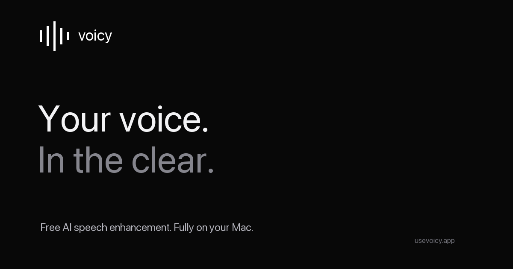

<p align="center">
  
</p>
<h1 align="center">Voicy</h1>
<p align="center"><strong>Free AI speech enhancement. Fully on your Mac.</strong></p>
<p align="center">A free, open-source Adobe Podcast alternative for Apple Silicon.<br/>Clean up speech, reduce noise and room echo, and keep your audio local.</p>
<p align="center">
  <a href="https://usevoicy.app">Website</a> ·
  <a href="https://usevoicy.app/#demo">Hear the demo</a> ·
  <a href="https://usevoicy.app/api/download">Download for Mac</a> ·
  <a href="#getting-started">Get started</a> ·
  <a href="https://github.com/jindratilk/voicy/issues">Report an issue</a>
</p>
<p align="center">
  
  
  
</p>



## Your voice. In the clear.

Voicy is a **free speech enhancer** for macOS. Drop in a recording, run AI speech enhancement locally, compare the original and enhanced versions at the same position, and export a 24-bit WAV.

No subscription. No account. No audio uploads. Models are included in the desktop download, so it works offline.

### Why Voicy?

- **Local AI enhancement:** Tencent AuK on Apple Silicon through MLX and Metal, with 32 solver steps.
- **Noise and echo cleanup:** bring speech forward in voice memos, podcasts, interviews and other recordings.
- **Native macOS integration:** Tauri with system window controls, menu bar, file dialogs and keyboard shortcuts.
- **A fair comparison:** switch between the original and the result while listening.
- **Adaptive memory use:** budgets respond to RAM, available headroom and macOS memory pressure.
- **Open source:** MIT application code, with separately licensed model assets and dependencies.

## Hear it yourself

[**Play the before / after demo →**](https://usevoicy.app/#demo)

The demo uses an ElevenLabs-generated voice with simulated laptop-fan noise and light room reflections. The enhanced version is actual Voicy AuK32 output, not the clean source substituted back in. Both samples are loudness-normalized. [Demo methodology](landing/public/audio/README.md).

## Getting started

1. [Download Voicy for Mac](https://usevoicy.app/api/download).
2. Open the disk image and drag **Voicy** into **Applications**.
3. Open a recording, enhance it, compare both versions, and export.

**Requirements:** Apple Silicon, macOS 14 or newer. Approximately 6.5 GB to download and 8 GB for the installed offline app, plus space for your recordings. 16 GB of unified memory or more is recommended. Intel Macs, Windows and mobile devices are not supported in this release.

| Action | Shortcut |
| --- | --- |
| Open audio | ⌘O |
| Enhance | ⌘Return |
| Play / pause | Space |
| Compare versions | ⇧⌘A |
| Export WAV | ⌘S |
| Recording history | ⇧⌘O |
| Quit and stop the engine | ⌘Q |

Closing the window keeps Voicy in the Dock. Your originals and previous successful results remain available if processing fails.

## A free Adobe Podcast alternative

Voicy offers **free AI speech enhancement** for people who want to clean up recordings on their own Mac. It is independent software, not an Adobe product and not a claim of identical results.

| Voicy workflow | What to expect |
| --- | --- |
| Processing | On your own Mac; no audio upload |
| Cost | Free; no subscription or credits |
| Installation | Large download with offline models included |
| Output | Mono, 48 kHz, 24-bit WAV |
| Model bandwidth | AuK operates at 24 kHz; resampling does not restore higher frequencies |
| Recording length and file size | No fixed application cap; available memory and disk space still apply |
| Speed | Not real time; depends on hardware and duration |

The 8.7-second website demo took about 60 seconds of model processing on an M5 with 32 GB RAM. This is one measurement, not a guarantee for other Macs. Our runtime optimization audit found no meaningful speed improvement beyond measurement variability; we do not claim 10× acceleration. [Performance evidence](docs/release/INFERENCE-PERFORMANCE-AUDIT.md).

**Listen before publishing.** Generative enhancement can change voice texture or damage words. Difficult recordings may not improve. Voicy preserves the original so you can compare and choose.

## Build and contribute

- [Build the macOS app](docs/release/BUILD.md)
- [Release procedure](docs/release/RELEASE.md)
- [Native validation and known limits](docs/release/VALIDATION.md)
- [macOS audit](docs/release/MACOS-AUDIT.md)
- [Website and admin deployment](landing/README.md)
- [Contributing](CONTRIBUTING.md) · [Security](SECURITY.md)

```text
web/          React desktop interface
src-tauri/    Native macOS app shell
server/       Local processing and audio pipeline
scripts/      Reproducible runtime, model and signing tools
landing/      Website, private admin and download service
```

Voicy uses the system WebKit view inside Tauri; it is not a SwiftUI application. Python and model inference run in separate processes.

## FAQ

**Is Voicy free and open source?** Yes. The application source is MIT licensed. Dependencies and models retain their own licenses.

**Does it enhance speech offline?** Yes. The desktop download includes the required models. The app has no hosted processing service and no usage analytics.

**Can I use it commercially?** The application code permits commercial use under MIT. Review the separate licenses for bundled models and dependencies and ensure you have rights to the audio you process.

**Can I use it in a browser?** The website provides a prerecorded demonstration. Enhancement happens in the macOS app, not on the website.

**Does it support music or real-time calls?** This release is intended for recorded speech. It is not a real-time microphone filter or a music mastering tool.

## Credits and license

Built with [AuK](https://github.com/Tencent-Hunyuan/AuK), [MLX](https://github.com/ml-explore/mlx), [Qwen](https://huggingface.co/Qwen/Qwen2.5-Omni-3B), [Tauri](https://tauri.app), React and FFmpeg. Thanks to their maintainers and contributors.

Application code: [MIT](LICENSE). See [third-party notices](THIRD_PARTY_NOTICES.md) for fonts, runtime libraries, model weights and bundled FFmpeg source obligations.

Voicy is not affiliated with Adobe, Tencent or Apple.
